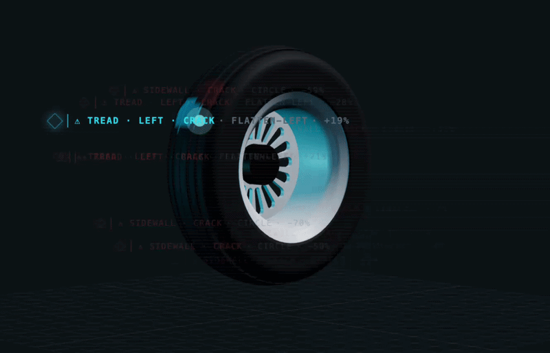
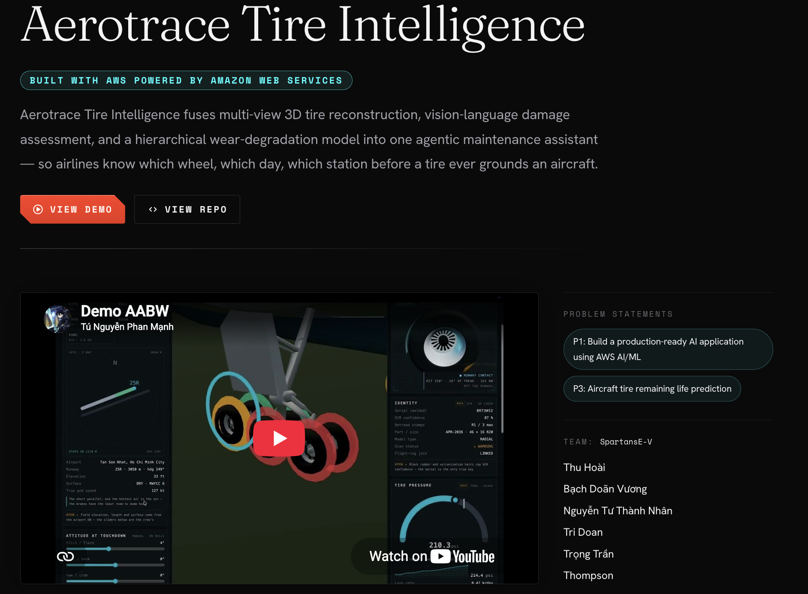

# Tire Ops — Web

<div align="center">


[](https://www.youtube.com/watch?v=dySqvJZkLSc)

<br />



</div>

---

<div align="center">


**Team: SpartansE-V**

Bạch Doãn Vương · Tú Nguyễn (Thompson)· Trí Đoàn (TeeA)· Trọng Trần (Alex) · Thu Hoài (Yinn) · Nhân Nguyễn 


</div>

React + Vite dashboard for the aircraft-tire POC. Three routes (`src/App.tsx`):

| Route | What |
|---|---|
| `/tyres` | 3D tire dashboard (mock telemetry) + a live **Remaining life** card |
| `/rul` | **RUL forecast** dashboard — fleet worklist, six-wheel RUL map, per-wheel forecast |
| `/simulate-landing` | Landing simulation |

## RUL integration (`src/rul/`)

The RUL views call the FastAPI backend at `/api/v1/tire_rul/*` (see `app/api/routes/tire_rul.py`):

- `src/rul/api.ts` — typed client + React Query hooks (`predict`, `fleet/worklist`, `wheel/status`).
- `src/rul/positions.ts` — maps the 14 dashboard wheels to the 6 canonical model positions.
- `src/rul/Rul.tsx` — the `/rul` dashboard. `src/rul/RemainingLifeCard.tsx` — the `/tyres` card.

### Running against the backend

```bash
# 1. backend (repo root) — serves :8000
make install-ai && make run

# 2. web dev server — proxies /api → :8000 (no CORS)
cd web && npm install && npm run dev
```

The dev server proxies `/api` to the backend (`vite.config.ts`); override the target with
`VITE_API_PROXY=http://host:port npm run dev` if the API runs elsewhere. In production the app calls
same-origin relative paths — point the static host's `/api` at the API, or set `VITE_API_BASE` to an
absolute origin at build time. When the fleet dataset is absent the backend returns `503` and the
`/rul` worklist degrades gracefully; per-wheel `/predict` (the Remaining-life card) still works.

---

## React + TypeScript + Vite

## Engineer Chat (maintenance agent)

The **Engineer Chat** tab (`/engineer-chat`) is a chat UI for the backend Maintenance Decision
Agent. It talks to the FastAPI service (`app/api/routes/tire_rul.py`):

- `POST /api/v1/tire_rul/agent/chat` — multi-turn agent chat (Markdown answer + tool-call trace)
- `GET /api/v1/tire_rul/fleet/worklist` — the live "Fleet priority" rail

The client lives in [`src/agentApi.ts`](src/agentApi.ts); the screen is
[`src/EngineerChat.tsx`](src/EngineerChat.tsx). The offline `backend` option needs no API key,
so the agent works out of the box.

**Local dev:** start the backend (`make run`, default `:8000`), then `npm run dev`. Vite proxies
`/api` to the backend (see [`vite.config.ts`](vite.config.ts)); override the target with
`VITE_API_PROXY=http://host:port`.

**Production:** the static bundle calls `/api/...` on its own origin. Either reverse-proxy `/api`
to the API from the web host, or build with `VITE_API_BASE=https://api.example.com` to point it at
the API origin directly.

---

This template provides a minimal setup to get React working in Vite with HMR and some Oxlint rules.

Currently, two official plugins are available:

- [@vitejs/plugin-react](https://github.com/vitejs/vite-plugin-react/blob/main/packages/plugin-react) uses [Oxc](https://oxc.rs)
- [@vitejs/plugin-react-swc](https://github.com/vitejs/vite-plugin-react/blob/main/packages/plugin-react-swc) uses [SWC](https://swc.rs/)

## React Compiler

The React Compiler is not enabled on this template because of its impact on dev & build performances. To add it, see [this documentation](https://react.dev/learn/react-compiler/installation).

## Expanding the Oxlint configuration

If you are developing a production application, we recommend enabling type-aware lint rules by installing `oxlint-tsgolint` and editing `.oxlintrc.json`:

```json
{
  "$schema": "./node_modules/oxlint/configuration_schema.json",
  "plugins": ["react", "typescript", "oxc"],
  "options": {
    "typeAware": true
  },
  "rules": {
    "react/rules-of-hooks": "error",
    "react/only-export-components": ["warn", { "allowConstantExport": true }]
  }
}
```

See the [Oxlint rules documentation](https://oxc.rs/docs/guide/usage/linter/rules) for the full list of rules and categories.

## Agentic AI


